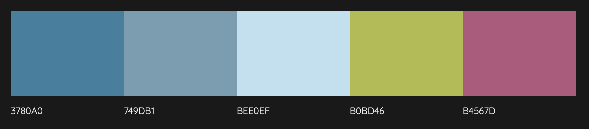

** Developer: Orna Reynolds **

[Visit live website]()

## Table of Content
  - [Project Goals](#project-goals)
    - [User Goals](#user-goals)
    - [Site Owner Goals](#site-owner-goals)
  - [User Experience](#user-experience)
    - [Target Audience](#target-audience)
    - [User Requirements and Expectations](#user-requirements-and-expectations)
  - [User Stories](#user-stories)
    - [Site User](#site-user)
    - [Site Owner](#site-owner)
  - [Design](#design)
    - [Colour Scheme](#colour-scheme)
    - [Fonts](#fonts)
    - [Structure](#structure)
    - [Wireframes](#wireframes)
  - [Technologies Used](#technologies-used)
    - [Languages](#languages)
    - [Frameworks, Libraries & Tools](#frameworks-libraries--tools)
  - [Features](#features)
  - [Validation](#validation)
    - [HTML Validation](#html-validation)
    - [CSS Validation](#css-validation)
    - [JavaScript Validation](#javascript-validation)
    - [Accessibility](#accessibility)
    - [Performance](#performance)
  - [Testing](#testing)
    - [Performing tests on various devices](#performing-tests-on-various-devices)
    - [Browser compatibility](#browser-compatibility)
    - [Testing user stories](#testing-user-stories)
  - [Bugs](#bugs)
  - [Deployment](#deployment)
  - [Credits](#credits)
  - [Acknowledgements](#acknowledgements)

  ## Project Goals

The goal of this project was to create an interactive and user-friendly quiz that tests knowledge of world geography.

### User Goals

- Take a quiz that is fun and informative 
- Challenge themselves at different difficulty levels 

### Site Owner Goals

- Create a quiz with accurate information on world geography
- Design quiz in visually apealling way to engage user
- Ensure accessibility and responsivity across different screen sizes

## User Experience

### Target Audience

- Anyone with an interest in world geography 
- Anyone who wants to test their knowledge of world geography 

### User Requirements and Expectations

- Simple, clear and interative layout 
- Responsiveness across different screen levels 
- Visible navigation to different difficulty levels, reset button

## User Stories

### Site User

1. I want to easily understand how to answer quiz
2. I want to have my name displayed while playing
3. I want a leaderboard to track the highest scores 
4. I want to be able to choose from different difficulty levels
5. I want incorrect answers to light up red and correct answers to light up green 
6. I want 3 guesses and for answer to then light up green so I can continue on with the quiz
7. I want the country name I clicked incorrectly to show up on screen so I can learn from my mistakes
8. I want to play game on phone and on laptop 

### Site Owner

9. I want user to easily play game
10. I want quiz be resposnsive on different devices
11. I want a 404 page to show in case of broken link
12. I want user to be able to challenge themselves 

## Design

### Colour Scheme

The colour palette was generated by <a href="http://colormind.io/image/">Colormind</a> when submitted a world map found on a google search. 

### Fonts
Itim from [Google Fonts](https://fonts.google.com/specimen/Itim?preview.text=Geography&preview.text_type=custom) was chosen as the font as it was clear, playful and had a hand-written feel which I felt suited the theme of the game. 

### Structure

The structure of the website was designed to be easy to navigate. 

The game consist of the following screens:

- A home page / start screen with instructions icon in the top line, game title and user login
- Choose game difficulty level screen
- Main game screen - it contains number of questions remaining in the round (progress bar), interactive map to click, current score and high score
- Highscore page with most recent scores from local storage
- The contact page with contact form which allows users to send an email to the developer and provide their feedback
- A separate 404 error page

### Wireframes

## Technologies Used

### Languages

- HTML
- CSS
- JavaScript

### Frameworks, Libraries & Tools

## Features

## Validation

### HTML Validation

### CSS Validation

### JavaScript Validation

### Accessibility

### Performance

## Testing

### Performing tests on various devices

### Browser compatibility

### Testing user stories

## Bugs

## Deployment

## Credits

### Images

### Code

## Acknowledgements
